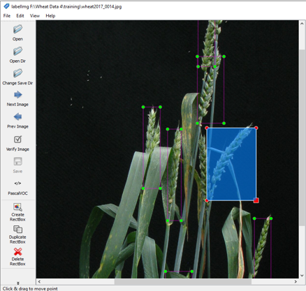

# Paper published CVPPA workshop at ICCV-2021

[Paper Link](https://openaccess.thecvf.com/content/ICCV2021W/CVPPA/papers/Bhagat_WheatNet-Lite_A_Novel_Light_Weight_Network_for_Wheat_Head_Detection_ICCVW_2021_paper.pdf)

Dataset used: 1. GWHD, 2. SPIKE and 3. ACID.

# ACID-dataset
Bounding Box annotations for ACID dataset 

Dataset provided for research purpose ping dataset request on Email: 2018pec901@sggs.ac.in

## Wheat head deetction results on ACID and SPIKE dataset.

Green boxes represents ground truth and red boxes represents prediction

# Please cite our paper if you are using dataset

[BibTeX Link](https://scholar.googleusercontent.com/scholar.bib?q=info:Lzm2pPfovw8J:scholar.google.com/&output=citation&scisdr=CgWP9QCCEIzNjUmUa9E:AAGBfm0AAAAAYZyRc9Ge4MQVnsWHIAgQtlgLy8yGnI-b&scisig=AAGBfm0AAAAAYZyRc4BK6keOslWiAFT1Ns2e8QFMS23W&scisf=4&ct=citation&cd=-1&hl=en)

